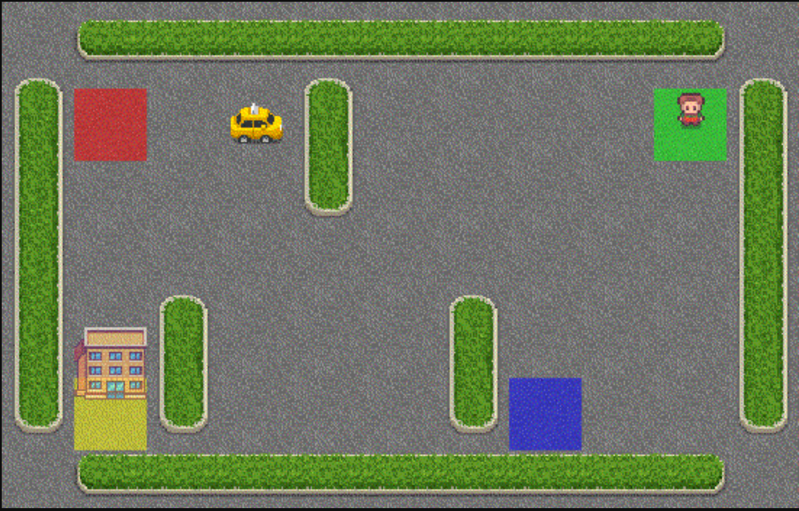

# RL Smart Taxi

Creating a smart taxi using reinforcement learning (Q-learning) to consistently and efficiently solve the taxi environment problem.

## The Taxi Environment

The "Taxi-v3" environment is part of the python Gymnasium library (forked from OpenAI's Gym library). 

There are four designated locations in the grid world indicated by Red, Green, Yellow, and Blue. When the episode starts, the taxi, the passenger, and the passenger's destination (shown by the building) start at different and randomized locations. The taxi must drive to the passenger’s initial location, pick up the passenger, then drive to the passenger’s destination, and then drop off the passenger. Once the passenger is dropped off, the episode ends. 

## Random Solution vs Q-Learning

At any state, there are 6 possible actions for the taxi (agent): North, East, South, West, Pickup, Dropoff.

Random Taxi - here is the taxi environment being solved by picking a random action at every state. This can be solved in anywhere between a few to 300+ epochs, depending on how 'lucky' the actions turn out:

<video width="320" controls>
  <source src="https://github.com/AdithyaR7/RL-Smart-Taxi/raw/refs/heads/main/taxi_sol_vids/random_taxi.mp4">
  Your browser does not support the video tag.
</video>

Smart Taxi - here is the agent efficiently carrying out moves to solve the problem in the most optimum way after Q-learning:
<video src="taxi_sol_vids/smart_taxi.mp4" width="700" />
